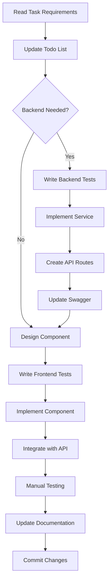

# Asset Manager Development Workflow Guide

## Overview
This guide outlines the complete development workflow for the Asset Manager project, including setup, development practices, testing, and deployment procedures.

## Table of Contents
1. [Initial Setup](#initial-setup)
2. [Development Workflow](#development-workflow)
3. [Git Workflow](#git-workflow)
4. [Testing Strategy](#testing-strategy)
5. [Code Review Process](#code-review-process)
6. [Deployment Process](#deployment-process)
7. [Troubleshooting](#troubleshooting)

## Initial Setup

### Prerequisites
```bash
# Required software
node --version  # v18.0.0 or higher
npm --version   # v9.0.0 or higher
docker --version # v20.0.0 or higher
git --version   # v2.30.0 or higher
```

### Repository Setup
```bash
# Clone the repository
git clone https://github.com/your-org/asset-manager.git
cd asset-manager

# Install dependencies
npm install

# Setup environment variables
cp .env.example .env.local
# Edit .env.local with your configuration

# Start Docker services
docker-compose up -d

# Run database migrations
cd backend
npm run prisma:migrate:dev
npm run prisma:seed  # Optional: seed with test data

# Start development servers
npm run dev  # Runs both frontend and backend
```

### IDE Configuration
```json
// Recommended VS Code extensions
{
  "recommendations": [
    "dbaeumer.vscode-eslint",
    "esbenp.prettier-vscode",
    "prisma.prisma",
    "bradlc.vscode-tailwindcss",
    "streetsidesoftware.code-spell-checker",
    "eamodio.gitlens",
    "usernamehw.errorlens"
  ]
}
```

## Development Workflow

### 1. Starting a New Feature

```bash
# Update main branch
git checkout main
git pull origin main

# Create feature branch
git checkout -b feature/AM-123-location-picker
# Format: feature/TICKET-ID-brief-description

# For Phase 2 work specifically
git checkout phase-2-core-functionality
git pull origin phase-2-core-functionality
git checkout -b feature/phase-2-location-ui
```

### 2. Backend Development Flow

```bash
# Navigate to backend
cd backend

# 1. Write tests first (TDD)
npm run test:watch -- location.service.test.ts

# 2. Implement service
# Edit src/services/location.service.ts

# 3. Create/update API routes
# Edit src/routes/locations.ts

# 4. Update Swagger docs
# Edit src/docs/swagger.ts

# 5. Run all tests
npm test

# 6. Check linting
npm run lint
npm run lint:fix  # Auto-fix issues

# 7. Type checking
npm run typecheck

# 8. Test API manually
npm run dev
# Use Thunder Client or Postman
```

### 3. Frontend Development Flow

```bash
# Navigate to frontend
cd frontend

# 1. Create component structure
mkdir -p src/components/locations
touch src/components/locations/LocationPicker.tsx
touch src/components/locations/LocationPicker.test.tsx

# 2. Write component tests
npm run test:watch -- LocationPicker.test.tsx

# 3. Implement component
# Follow the implementation guides

# 4. Create/update hooks
# Edit src/hooks/use-locations.ts

# 5. Update API integration
# Edit src/api/location-api.ts

# 6. Test in browser
npm run dev
# Navigate to http://localhost:3000

# 7. Run all checks
npm run lint
npm run typecheck
npm test
```

### 4. Full-Stack Feature Implementation



## Git Workflow

### Commit Message Convention
```bash
# Format: type(scope): description

# Types:
# feat: New feature
# fix: Bug fix
# docs: Documentation only
# style: Code style changes
# refactor: Code refactoring
# test: Test additions/changes
# chore: Build process or auxiliary tool changes

# Examples:
git commit -m "feat(assets): add location picker component"
git commit -m "fix(auth): resolve token refresh race condition"
git commit -m "docs(api): update asset endpoint documentation"
git commit -m "test(locations): add integration tests for location service"
```

### Daily Development Flow
```bash
# Start of day
git checkout main
git pull origin main
git checkout feature/your-branch
git merge main  # or rebase if preferred

# During development
git add -p  # Stage changes interactively
git commit -m "feat(component): implement base structure"

# Multiple commits per day encouraged
git commit -m "test(component): add unit tests"
git commit -m "fix(component): handle edge case"

# End of day
git push origin feature/your-branch
```

### Pull Request Process
```bash
# Before creating PR
npm run lint:fix
npm run typecheck
npm test
npm run test:integration

# Push latest changes
git push origin feature/your-branch

# Create PR via GitHub UI or CLI
gh pr create --title "feat: Add location picker component" \
  --body "## Description
  Implements hierarchical location picker for asset management.
  
  ## Changes
  - Added LocationPicker component
  - Created useLocations hook
  - Added location API integration
  
  ## Testing
  - [x] Unit tests pass
  - [x] Integration tests pass
  - [x] Manual testing completed
  
  ## Screenshots
  [Add screenshots if UI changes]
  
  Closes #123"
```

## Testing Strategy

### Test Levels
```
Unit Tests (60%)
├── Services
├── Utilities
├── Components
└── Hooks

Integration Tests (30%)
├── API Endpoints
├── Database Operations
└── Component Integration

E2E Tests (10%)
├── Critical User Flows
├── Authentication
└── Core Features
```

### Running Tests
```bash
# Backend tests
cd backend
npm test                 # All tests
npm run test:unit       # Unit tests only
npm run test:integration # Integration tests
npm run test:e2e        # E2E tests
npm run test:coverage   # With coverage report

# Frontend tests
cd frontend
npm test                # All tests
npm run test:watch      # Watch mode
npm run test:coverage   # Coverage report
npm run test:e2e        # Playwright E2E tests
```

### Writing Effective Tests
```typescript
// Good test example
describe('LocationService', () => {
  describe('createLocation', () => {
    it('should create location with valid data', async () => {
      // Arrange
      const locationData = createMockLocationData();
      const expectedLocation = createMockLocation(locationData);
      
      prismaMock.location.create.mockResolvedValue(expectedLocation);
      
      // Act
      const result = await locationService.createLocation(
        locationData,
        mockOrganizationId
      );
      
      // Assert
      expect(result).toEqual(expectedLocation);
      expect(prismaMock.location.create).toHaveBeenCalledWith({
        data: expect.objectContaining({
          ...locationData,
          organizationId: mockOrganizationId,
        }),
      });
    });
    
    it('should throw ConflictError for duplicate names', async () => {
      // Test error cases...
    });
  });
});
```

## Code Review Process

### Before Requesting Review
- [ ] All tests pass
- [ ] Code follows style guide
- [ ] No console.logs or debug code
- [ ] Documentation updated
- [ ] Swagger/API docs updated
- [ ] No sensitive data exposed
- [ ] Performance considered
- [ ] Accessibility checked

### Review Checklist for Reviewers
- [ ] Code meets requirements
- [ ] Tests are adequate
- [ ] No security vulnerabilities
- [ ] Performance is acceptable
- [ ] Code is maintainable
- [ ] Documentation is clear
- [ ] No breaking changes (or documented)
- [ ] Follows project patterns

### Addressing Review Feedback
```bash
# Make requested changes
git add -p
git commit -m "fix: address review feedback"

# Or amend if single commit
git commit --amend

# Push changes
git push origin feature/your-branch

# Reply to review comments
# Mark conversations as resolved
```

## Deployment Process

### Development Environment
```bash
# Automatic deployment on push to main
# Deploys to: https://dev.asset-manager.example.com
git push origin main
```

### Staging Environment
```bash
# Create release branch
git checkout -b release/v2.1.0
git push origin release/v2.1.0

# GitHub Actions deploys to staging
# URL: https://staging.asset-manager.example.com
```

### Production Deployment
```bash
# After staging validation
git checkout main
git merge release/v2.1.0
git tag -a v2.1.0 -m "Release version 2.1.0"
git push origin main --tags

# Manual approval required in GitHub Actions
# Deploys to: https://asset-manager.example.com
```

### Rollback Procedure
```bash
# Quick rollback
git revert HEAD
git push origin main

# Or revert to specific version
git checkout v2.0.9
git checkout -b hotfix/rollback-to-2.0.9
git push origin hotfix/rollback-to-2.0.9
# Create PR and fast-track merge
```

## Troubleshooting

### Common Issues

#### 1. Docker Issues
```bash
# Reset Docker environment
docker-compose down -v
docker system prune -a
docker-compose up -d --build

# Check logs
docker-compose logs -f backend
docker-compose logs -f postgres
```

#### 2. Database Issues
```bash
# Reset database
cd backend
npm run prisma:migrate:reset
npm run prisma:seed

# Check migrations
npm run prisma:migrate:status

# Generate Prisma client
npm run prisma:generate
```

#### 3. Dependency Issues
```bash
# Clear all caches
rm -rf node_modules package-lock.json
npm cache clean --force
npm install

# Check for conflicts
npm ls
npm audit
```

#### 4. Test Failures
```bash
# Run specific test file
npm test -- --testPathPattern=location.service.test.ts

# Debug test
npm test -- --detectOpenHandles --forceExit

# Update snapshots
npm test -- -u
```

#### 5. Build Issues
```bash
# Clean build
cd backend
rm -rf dist
npm run build

cd ../frontend
rm -rf .next
npm run build
```

### Performance Debugging
```bash
# Backend profiling
NODE_ENV=production node --prof backend/dist/server.js
node --prof-process isolate-*.log > profile.txt

# Frontend bundle analysis
cd frontend
npm run build:analyze

# Database query analysis
# Check backend/logs/queries.log
```

### Getting Help
1. Check existing documentation
2. Search closed issues on GitHub
3. Ask in team Slack channel
4. Create detailed GitHub issue
5. Tag relevant team members

## Best Practices Summary

1. **Always work in feature branches**
2. **Write tests before code (TDD)**
3. **Commit early and often**
4. **Keep PRs small and focused**
5. **Update documentation as you go**
6. **Run all checks before pushing**
7. **Respond to reviews promptly**
8. **Test in multiple browsers**
9. **Consider mobile users**
10. **Monitor performance impact**

## Useful Commands Reference

```bash
# Development
npm run dev           # Start all services
npm run dev:backend   # Backend only
npm run dev:frontend  # Frontend only

# Testing
npm test              # Run all tests
npm run test:watch    # Watch mode
npm run test:coverage # Coverage report

# Code Quality
npm run lint          # Check linting
npm run lint:fix      # Fix linting issues
npm run typecheck     # TypeScript check
npm run format        # Format code

# Database
npm run prisma:studio # Visual database browser
npm run prisma:migrate:dev # Run migrations
npm run prisma:seed   # Seed database

# Production
npm run build         # Build for production
npm run start         # Start production server
```

Remember: Good development practices lead to maintainable code and happy teams! 🚀