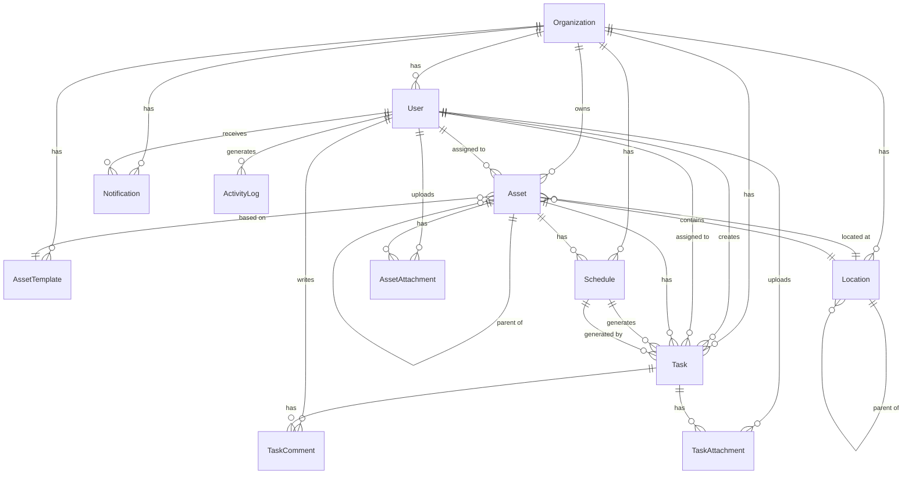

# Asset Manager Database Schema - Phase 2

## Overview

This document describes the database schema for the Asset Manager system after Phase 2 implementation. The schema uses PostgreSQL with Prisma ORM.

## Entity Relationship Diagram

## Core Entities

### Organization
Central entity for multi-tenancy.

| Field | Type | Description |
|-------|------|-------------|
| id | UUID | Primary key |
| name | String | Organization name |
| settings | JSON | Organization-specific settings |
| ownerUserId | UUID | Reference to owner user |
| createdAt | DateTime | Creation timestamp |
| updatedAt | DateTime | Last update timestamp |

### User
System users with role-based access.

| Field | Type | Description |
|-------|------|-------------|
| id | UUID | Primary key |
| email | String | Unique email address |
| fullName | String? | User's full name |
| role | Enum | OWNER, MANAGER, MEMBER, VIEWER |
| organizationId | UUID | Organization reference |
| emailVerified | Boolean | Email verification status |
| totpEnabled | Boolean | 2FA enabled flag |
| isActive | Boolean | Account active status |
| notificationPreferences | JSON | Notification settings |
| createdAt | DateTime | Creation timestamp |
| updatedAt | DateTime | Last update timestamp |

## Asset Management Entities

### Asset
Core asset entity with hierarchical support.

| Field | Type | Description |
|-------|------|-------------|
| id | UUID | Primary key |
| organizationId | UUID | Organization reference |
| name | String | Asset name |
| description | String? | Detailed description |
| category | Enum | Asset category |
| status | Enum | Operational status |
| assetTemplateId | UUID? | Template reference |
| locationId | UUID? | Location reference |
| parentId | UUID? | Parent asset reference |
| path | String | Materialized path for hierarchy |
| manufacturer | String? | Manufacturer name |
| modelNumber | String? | Model identifier |
| serialNumber | String? | Unique serial number |
| purchaseDate | DateTime? | Purchase date |
| purchasePrice | Decimal? | Purchase cost |
| warrantyExpiry | DateTime? | Warranty end date |
| assignedUserId | UUID? | Assigned user |
| qrCode | String? | QR code value |
| link | String? | External URL |
| tags | String[] | Searchable tags |
| customFields | JSON? | Template custom fields |
| createdAt | DateTime | Creation timestamp |
| updatedAt | DateTime | Last update timestamp |

### AssetTemplate
Templates for standardizing asset creation.

| Field | Type | Description |
|-------|------|-------------|
| id | UUID | Primary key |
| organizationId | UUID | Organization reference |
| name | String | Template name |
| description | String? | Template description |
| category | Enum | Default category |
| manufacturer | String? | Default manufacturer |
| customFieldsSchema | JSON | Custom field definitions |
| defaultValues | JSON | Default field values |
| isActive | Boolean | Template active status |
| createdAt | DateTime | Creation timestamp |
| updatedAt | DateTime | Last update timestamp |

### Location
Hierarchical location management.

| Field | Type | Description |
|-------|------|-------------|
| id | UUID | Primary key |
| organizationId | UUID | Organization reference |
| name | String | Location name |
| description | String? | Location description |
| parentId | UUID? | Parent location |
| path | String | Materialized path |
| metadata | JSON? | Additional data |
| createdAt | DateTime | Creation timestamp |
| updatedAt | DateTime | Last update timestamp |

### AssetAttachment
File attachments for assets.

| Field | Type | Description |
|-------|------|-------------|
| id | UUID | Primary key |
| assetId | UUID | Asset reference |
| uploadedByUserId | UUID | Uploader reference |
| originalFilename | String | Original file name |
| storedFilename | String | Storage file name |
| filePath | String | Storage path |
| fileSizeBytes | BigInt | File size |
| mimeType | String | MIME type |
| attachmentType | String | Type classification |
| isPrimary | Boolean | Primary image flag |
| createdAt | DateTime | Upload timestamp |

## Task Management Entities

### Schedule
Maintenance schedule definitions.

| Field | Type | Description |
|-------|------|-------------|
| id | UUID | Primary key |
| organizationId | UUID | Organization reference |
| assetId | UUID | Asset reference |
| name | String | Schedule name |
| description | String? | Schedule description |
| type | Enum | ONE_OFF, FIXED_INTERVAL, CUSTOM |
| isActive | Boolean | Schedule active status |
| recurrenceRule | String? | RRULE for custom |
| intervalDays | Int? | Days between tasks |
| taskTemplate | JSON | Task creation template |
| startDate | DateTime | Schedule start |
| endDate | DateTime? | Schedule end |
| lastRunAt | DateTime? | Last execution |
| nextRunAt | DateTime? | Next execution |
| createdAt | DateTime | Creation timestamp |
| updatedAt | DateTime | Last update timestamp |

### Task
Maintenance and work tasks.

| Field | Type | Description |
|-------|------|-------------|
| id | UUID | Primary key |
| organizationId | UUID | Organization reference |
| assetId | UUID | Asset reference |
| scheduleId | UUID? | Schedule reference |
| createdByUserId | UUID | Creator reference |
| title | String | Task title |
| description | String? | Task details |
| status | Enum | PLANNED, IN_PROGRESS, DONE, SKIPPED |
| priority | Enum | HIGH, MEDIUM, LOW |
| dueDate | DateTime? | Due date |
| completedAt | DateTime? | Completion timestamp |
| estimatedMinutes | Int? | Estimated duration |
| actualMinutes | Int? | Actual duration |
| estimatedCost | Decimal? | Estimated cost |
| actualCost | Decimal? | Actual cost |
| notes | String? | Additional notes |
| isAutomated | Boolean | Auto-generated flag |
| createdAt | DateTime | Creation timestamp |
| updatedAt | DateTime | Last update timestamp |

### TaskAssignment
Many-to-many task assignments.

| Field | Type | Description |
|-------|------|-------------|
| id | UUID | Primary key |
| taskId | UUID | Task reference |
| userId | UUID | User reference |
| assignedAt | DateTime | Assignment timestamp |

### TaskComment
Comments on tasks.

| Field | Type | Description |
|-------|------|-------------|
| id | UUID | Primary key |
| taskId | UUID | Task reference |
| userId | UUID | User reference |
| content | String | Comment text |
| createdAt | DateTime | Creation timestamp |

### TaskAttachment
File attachments for tasks.

| Field | Type | Description |
|-------|------|-------------|
| id | UUID | Primary key |
| taskId | UUID | Task reference |
| uploadedByUserId | UUID | Uploader reference |
| originalFilename | String | Original file name |
| storedFilename | String | Storage file name |
| filePath | String | Storage path |
| fileSizeBytes | BigInt | File size |
| mimeType | String | MIME type |
| createdAt | DateTime | Upload timestamp |

## System Entities

### Notification
In-app and email notifications.

| Field | Type | Description |
|-------|------|-------------|
| id | UUID | Primary key |
| organizationId | UUID | Organization reference |
| userId | UUID | Recipient reference |
| type | String | Notification type |
| title | String | Notification title |
| message | String | Notification content |
| metadata | JSON? | Additional data |
| isRead | Boolean | Read status |
| readAt | DateTime? | Read timestamp |
| assetId | UUID? | Related asset |
| taskId | UUID? | Related task |
| scheduleId | UUID? | Related schedule |
| createdAt | DateTime | Creation timestamp |

### ActivityLog
Audit trail for all actions.

| Field | Type | Description |
|-------|------|-------------|
| id | UUID | Primary key |
| organizationId | UUID | Organization reference |
| userId | UUID? | Actor reference |
| action | String | Action performed |
| entityType | String | Entity type affected |
| entityId | String | Entity ID affected |
| metadata | JSON? | Additional context |
| ipAddress | String? | Request IP |
| userAgent | String? | Request user agent |
| createdAt | DateTime | Action timestamp |

### ApiKey
API keys for programmatic access.

| Field | Type | Description |
|-------|------|-------------|
| id | UUID | Primary key |
| userId | UUID | User reference |
| name | String | Key name |
| keyHash | String | Hashed key value |
| lastUsedAt | DateTime? | Last usage |
| expiresAt | DateTime? | Expiration date |
| permissions | JSON | Allowed permissions |
| createdAt | DateTime | Creation timestamp |

## Enumerations

### UserRole
- OWNER: Full system access
- MANAGER: Manage assets and users
- MEMBER: Create and edit assets
- VIEWER: Read-only access

### AssetCategory
- HARDWARE
- SOFTWARE
- FURNITURE
- VEHICLE
- EQUIPMENT
- PROPERTY
- OTHER

### AssetStatus
- OPERATIONAL
- MAINTENANCE
- REPAIR
- RETIRED
- DISPOSED
- LOST

### TaskStatus
- PLANNED
- IN_PROGRESS
- DONE
- SKIPPED

### TaskPriority
- HIGH
- MEDIUM
- LOW

### ScheduleType
- ONE_OFF
- FIXED_INTERVAL
- CUSTOM

## Indexes

### Performance Indexes
- `organization_id` on all entities
- `email` on User (unique)
- `asset_id` on Schedule, Task
- `parent_id` on Asset, Location
- `path` on Asset, Location (for hierarchy queries)
- `status` on Task
- `due_date` on Task
- `is_read` on Notification
- Composite indexes for common query patterns

### Full-Text Search
- `name`, `description`, `serial_number` on Asset
- `title`, `description` on Task

## Constraints

### Foreign Key Constraints
- All organizational data cascades on organization deletion
- Asset children cascade on parent deletion
- Tasks remain when schedule is deleted (historical record)
- Soft deletes for audit trail preservation

### Check Constraints
- `purchase_price >= 0`
- `estimated_minutes >= 0`
- `actual_minutes >= 0`
- `estimated_cost >= 0`
- `actual_cost >= 0`
- Valid email format
- Valid URL format for links

## Migration Notes

### Phase 2 Additions
1. Added `category` field to Asset (required)
2. Added Location entity with hierarchy
3. Added AssetTemplate entity
4. Added Schedule entity
5. Enhanced Task with scheduling support
6. Added file attachment entities
7. Added notification system
8. Added custom fields support

### Data Migration
- Existing assets default to 'OTHER' category
- Existing tasks linked to manual creation
- Historical data preserved during migration