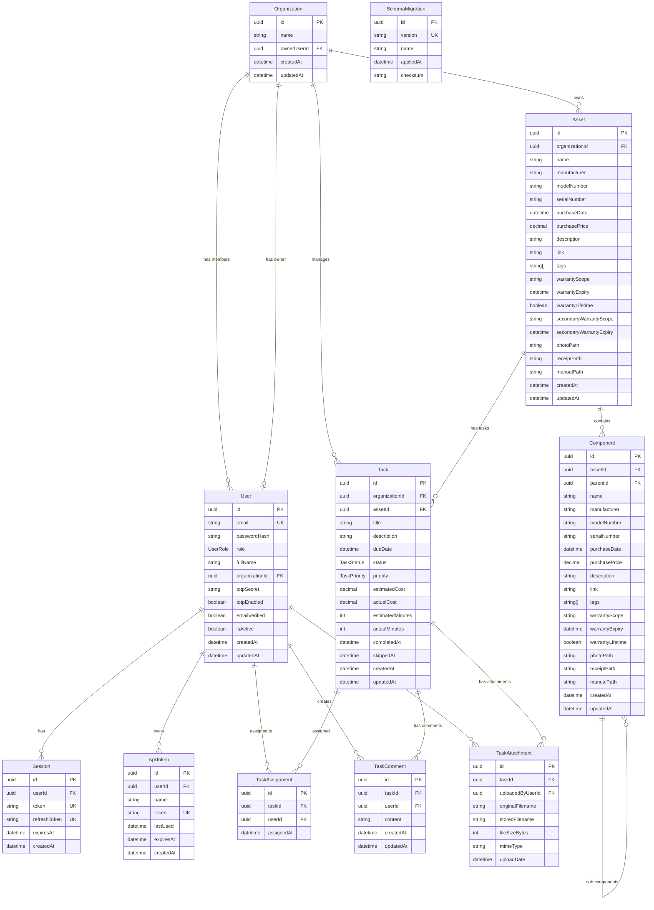

# Database Schema Diagram

This document provides a visual representation of the DumbAssets Enhanced database schema, designed for Phase 1 implementation with core user management, authentication, organizations, assets, and task management.

## Entity Relationship Diagram

## Enums

### UserRole
- `OWNER`: Full access to organization, can manage all users and settings
- `MANAGER`: Can manage users, assets, and tasks within the organization
- `MEMBER`: Can view and edit assets/tasks they have access to
- `VIEWER`: Read-only access to organization resources

### TaskStatus
- `PLANNED`: Task is planned but not started
- `IN_PROGRESS`: Task is currently being worked on
- `DONE`: Task has been completed
- `SKIPPED`: Task was skipped/cancelled

### TaskPriority
- `HIGH`: Urgent, critical tasks
- `MEDIUM`: Normal priority tasks (default)
- `LOW`: Low priority, non-urgent tasks

## Key Relationships

### Organization Management
- Each **Organization** has one **Owner** (User with OWNER role)
- Each **Organization** can have multiple **Users** as members
- All resources (Assets, Tasks) belong to an Organization for data isolation

### Authentication & Authorization
- **Users** can have multiple **Sessions** for different devices/browsers
- **Users** can create multiple **API Tokens** for programmatic access
- **Sessions** and **API Tokens** are automatically cleaned up when Users are deleted
- TOTP (Two-Factor Authentication) is optional and stored securely

### Asset Management
- **Assets** can contain multiple **Components** (hierarchical structure)
- **Components** can have sub-components (recursive relationship)
- **Assets** and **Components** support warranty tracking, file attachments, and tagging

### Task Management
- **Tasks** can be associated with **Assets** (optional)
- **Tasks** can be assigned to multiple **Users** via **TaskAssignments**
- **Tasks** support comments, file attachments, and time/cost tracking
- Task assignment is many-to-many (Users can have multiple Tasks, Tasks can have multiple Users)

## Indexes

The schema includes strategic indexes for performance:

- **Organizations**: Primary key
- **Users**: email (unique), organizationId
- **Sessions**: userId, token (unique)
- **ApiTokens**: userId, token (unique)
- **Assets**: organizationId
- **Components**: assetId, parentId
- **Tasks**: organizationId, assetId, dueDate, status
- **TaskAssignments**: taskId, userId, composite unique(taskId, userId)
- **TaskComments**: taskId, userId
- **TaskAttachments**: taskId, uploadedByUserId

## Security Features

1. **Data Isolation**: All resources are scoped to Organizations
2. **Role-Based Access Control**: Four-tier permission system
3. **Secure Authentication**: 
   - Password hashing with bcrypt
   - Optional TOTP 2FA
   - JWT-based sessions with refresh tokens
   - API token support
4. **Audit Trail**: Created/updated timestamps on all entities
5. **Cascade Deletion**: Proper cleanup when Organizations or Users are deleted

## Future Extensions

The schema is designed to support future phases:
- Additional asset types and custom fields
- Advanced task workflows and automation
- Integration with external systems
- File storage and attachment management
- Reporting and analytics
- Calendar integration for maintenance scheduling
